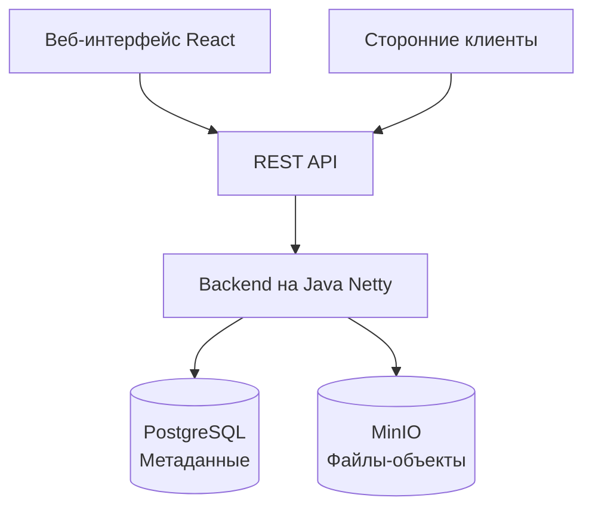

# MWS Cloud Storage ☁️

**MWS Cloud Storage** — это полнофункциональное облачное хранилище файлов, разработанное на Java. Проект представляет собой альтернативу таким сервисам, как Google Drive или Яндекс.Диск, с акцентом на простой REST API, систему тегов и прозрачную архитектуру.

## 🚀 Установка и запуск

Проект состоит из двух частей: **backend** (Java) и **frontend** (React)

1. **Клонируйте репозиторий**
``` bash
git clone https://github.com/algaa22/MWS-Cloud-Storage_team-4.git
cd MWS-Cloud-Storage_team-4
```
2. **Создайте файл с переменными окружения `.env`**

Для запуска через `docker-compose`: в корневой папке проекта создайте `.env`.

Например:
```bash
DB_URL=jdbc:postgresql://postgres:5432/cloud_storage_db
DB_NAME=cloud_storage_db
DB_USERNAME=postgres  
DB_PASSWORD=super_secret_password_123  
  
MINIO_URL=http://minio:9000
MINIO_USERNAME=minioadmin
MINIO_PASSWORD=super_secret_password_123

JWT_SECRET_KEY=d8f4a9c3e7b2f6a1d9e4c8b3f7a2e5d1f9c6b4e8a3d7f2c9e1b5f8d3a6c9e4b7
```
3. **Настройте конфигурационный файл `resources/config.yml`**
4. **Соберите docker-образ**

В корневой папке проекта запустите:
``` bash
docker build -t cloud-storage-app .
```
5. **Запустите всю инфраструктуру через `docker-compose`**
```bash
docker-compose up -d
```
6. (Дополнительно) **Запуск `frontend` вручную** (для разработки)

В папке `cloud-storage-frontend` введите:
``` bash
npm run dev
```

## 🔐 Настройка HTTPS

Если вы планируете запустить сервер на HTTPS, то перед сборкой добавьте ваши SSL-сертификаты `server.crt`, `server.csr`, `server.key`, `server.p12` в папке проекта `resources/ssl`

## ✨ Возможности

#### 📁 Работа с файлами

- **Загрузка и скачивание любого размера** — система позволяет использовать чанковую передачу для файлов больших размеров

- **Полноценная файловая система** — создание, перемещение, переименование и удаление папок и файлов через удобный веб-интерфейс

- **Гибкая организация** — поддержка системы тегов для категоризации файлов помимо классической структуры папок

- **Контроль доступа** — настраиваемая видимость файлов (приватные, доступные по ссылке, публичные)

*Примечание:* минимальный размер файла для чанковой передачи — `5 MB`

#### 🔐 Безопасность и учётные записи

- **Полный цикл аутентификации** — регистрация, вход и выход

- **Надёжные сессии** — JWT-токены с автоматической ротацией через refresh-токены

- **Управление профилем** — изменение имени пользователя и пароля


**🌐 Веб-интерфейс**

- **Удобный веб-клиент** — интуитивный интерфейс для управления файлами без необходимости использовать API напрямую

## 🏗️ Архитектура
[Схема и краткое объяснение, как всё устроено]

## 🛠 Технологии
[Список технологий с иконками (shields.io)]

## 📖 Документация
[Ссылка на API docs, или описание ключевых эндпоинтов]



## 👨‍💻 Разработка
[Как собрать проект из исходников, запустить тесты]

## 🗺️ Roadmap
[Планы на будущее]
## 👥 Команда / Контакты
[Кто делал и как связаться]