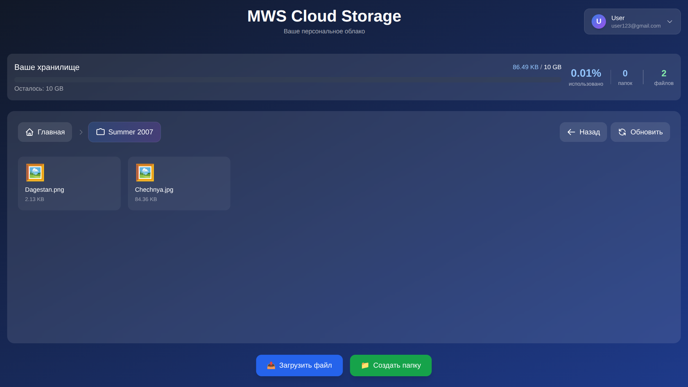
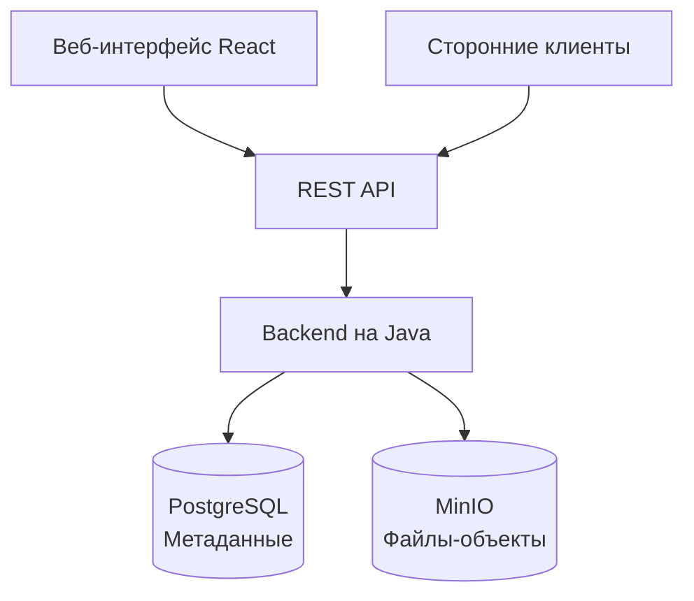

# MWS Cloud Storage ☁️

**MWS Cloud Storage** — это полнофункциональное облачное хранилище файлов, разработанное на Java. Проект представляет собой альтернативу таким сервисам, как Google Drive или Яндекс.Диск, с акцентом на простой REST API, систему тегов и прозрачную архитектуру.



*Главная страница веб-интерфейса*

## 🚀 Установка и запуск

Проект состоит из двух частей: **backend** (Java) и **frontend** (React)

1. **Клонируйте репозиторий**
``` bash
git clone https://github.com/algaa22/MWS-Cloud-Storage_team-4.git
cd MWS-Cloud-Storage_team-4
```
2. **Создайте файл с переменными окружения `.env`**

Для запуска через `docker-compose`: в корневой папке проекта создайте `.env`.

Например:
```bash
DB_URL=jdbc:postgresql://postgres:5432/cloud_storage_db
DB_NAME=cloud_storage_db
DB_USERNAME=postgres  
DB_PASSWORD=super_secret_password_123  
  
MINIO_URL=http://minio:9000
MINIO_USERNAME=minioadmin
MINIO_PASSWORD=super_secret_password_123

JWT_SECRET_KEY=d8f4a9c3e7b2f6a1d9e4c8b3f7a2e5d1f9c6b4e8a3d7f2c9e1b5f8d3a6c9e4b7
```
3. **Настройте конфигурационный файл `src/main/resources/config.yml`**
4. **Соберите docker-образ**

В корневой папке проекта запустите:
``` bash
docker build -t cloud-storage-app .
```
5. **Запустите всю инфраструктуру через `docker-compose`**
```bash
docker-compose up -d
```
6. (Дополнительно) **Запустите `frontend` вручную** (для разработки)

В папке `cloud-storage-frontend` введите:
``` bash
npm run dev
```

## 🔐 Настройка HTTPS

Если вы планируете запустить сервер на HTTPS, то перед сборкой добавьте ваши SSL-сертификаты `server.crt`, `server.csr`, `server.key`, `server.p12` в папке проекта `resources/ssl`

## ✨ Возможности

#### 📁 Работа с файлами

- **Загрузка и скачивание любого размера** — система позволяет использовать чанковую передачу для файлов больших размеров

- **Полноценная файловая система** — создание, перемещение, переименование и удаление папок и файлов через удобный веб-интерфейс

- **Гибкая организация** — поддержка системы тегов для категоризации файлов помимо классической структуры папок

- **Контроль доступа** — настраиваемая видимость файлов (приватные, доступные по ссылке, публичные)

*Техническая деталь:* для соответствия стандартам S3-совместимых хранилищ чанковая передача используется для файлов с размером от `5 МБ`

#### 🔐 Безопасность и учётные записи

- **Полный цикл аутентификации** — регистрация, вход и выход

- **Надёжные сессии** — JWT-токены с автоматической ротацией через refresh-токены

- **Управление профилем** — изменение имени пользователя и пароля


**🌐 Веб-интерфейс**

- **Удобный веб-клиент** — интуитивный интерфейс для управления файлами без необходимости использовать API напрямую

## 🏗️ Архитектура

Система состоит из **независимых модулей**, каждый из которых отвечает за свою задачу. Пользователь может работать как через **веб-интерфейс**, так и напрямую через **API**.




#### Ключевые архитектурные решения:

1. **Разделение логики и данных**

    - **PostgreSQL** хранит всю **логическую структуру**: пользователей, виртуальные пути файлов, теги, права доступа

    - **MinIO (S3-совместимое)** хранит **сами файлы** как объекты. Это обеспечивает отказоустойчивость и эффективность для больших бинарных данных

2. **Двухуровневая система путей**

    - **Для пользователя**: привычные пути (`documents/report.pdf`)

    - **Для системы**: в MinIO файл хранится по ключу `user_id/file_id`, что идеально соответствует объектной модели S3 и обеспечивает высокую производительность

3. **Единая точка входа**

    - Весь доступ к системе происходит **только через REST API** нашего backend

4. **Контейнеризация**

    - Каждый компонент (Backend, PostgreSQL, MinIO) работает в **отдельном Docker-контейнере**. Это гарантирует идентичность окружений на всех машинах и упрощает развёртывание одной командой (`docker-compose up`)
## 🛠 Технологии


## 📖 Документация API (основные эндпоинты)

Все запросы, кроме регистрации и входа, требуют передачи **access-токена** в заголовке `X-Auth-Token`.

### 🔐 Аутентификация

| Метод  | Эндпоинт                   | Назначение        | Ключевые заголовки                                   |
| ------ | -------------------------- | ----------------- | ---------------------------------------------------- |
| `POST` | `/api/users/auth/register` | Регистрация       | `X-Auth-Email`, `X-Auth-Password`, `X-Auth-Username` |
| `POST` | `/api/users/auth/login`    | Вход              | `X-Auth-Email`, `X-Auth-Password`                    |
| `POST` | `/api/users/auth/refresh`  | Обновление токена | `X-Refresh-Token`                                    |
| `POST` | `/api/users/auth/logout`   | Выход             | `X-Auth-Token`                                       |

### 📁 Работа с файлами и папками

| Метод    | Эндпоинт                           | Назначение           | Ключевые заголовки                                       | Опциональные параметры            |
| -------- | ---------------------------------- | -------------------- | -------------------------------------------------------- | --------------------------------- |
| `GET`    | `/api/files/list`                  | Список файлов        | —                                                        | `directory`, `includeDirectories` |
| `POST`   | `/api/files/upload?path=...`       | Загрузка файла       | `X-File-Size`, `X-File-Tags`                             | —                                 |
| `GET`    | `/api/files?path=...`              | Скачивание файла     | —                                                        | —                                 |
| `PUT`    | `/api/files?path=...&newPath=...`  | Изменение метаданных | `X-File-Visibility`, `X-File-Tags` (хотя бы одно из них) | —                                 |
| `DELETE` | `/api/files?path=...`              | Удаление файла       | —                                                        | —                                 |
| `PUT`    | `/api/directories?path=...`        | Создание папки       | —                                                        | —                                 |
| `POST`   | `/api/directories?from=...&to=...` | Перемещение папки    | —                                                        | —                                 |

### 👤 Управление профилем

| Метод  | Эндпоинт            | Назначение                | Ключевые заголовки                                   |
| ------ | ------------------- | ------------------------- | ---------------------------------------------------- |
| `GET`  | `/api/users/info`   | Информация о пользователе | —                                                    |
| `POST` | `/api/users/update` | Обновление данных         | `X-New-Username`, `X-Old-Password`, `X-New-Password` |

## 🗺️ Roadmap

Мы активно развиваем проект и планируем реализовать следующие функции и улучшения:

- **Переход на Spring** для ускорения разработки и использования готовых enterprise-решений

- **Система уровней доступа** к файлам и папкам с гибкими правилами для совместной работы

- **Расширенный поиск по файлам** для полнотекстового поиска и фильтрации

- **Внедрение тарифных планов** и системы монетизации

- **Усиление безопасности**: защита от инъекций, улучшение валидации и прочее

- **Готовый фронтенд** с полировкой UI/UX, адаптивным дизайном и улучшенной производительностью

- **Улучшенный выбор типа загрузки**

- **Реализация миграций базы данных** для безопасного и контролируемого изменения таблиц

- **Система уведомлений** о важных событиях

- **Работа с куками (Cookies)** для улучшенного управления сессиями на фронтенде.

- **Разделение файлов и папок по отдельным таблицам** для оптимизации структуры базы данных

## 👥 Команда / Контакты

**Команда:**
*   **Сергей** @seregawallapop — Техлид, backend (Архитектура, Netty, API)

*   **Анастасия** @alg_aaa — Тимлид, backend, frontend (Сервисы, React, UI/UX)

*   **Павел** @PavelStar899 — backend (PostgreSQL, MinIO)

**Обратная связь:**  
По всем вопросам, связанным с проектом, пожалуйста, создавайте **Issue** в репозитории проекта на GitHub.

_© 2025 Команда MWS Cloud Storage. Все права защищены._