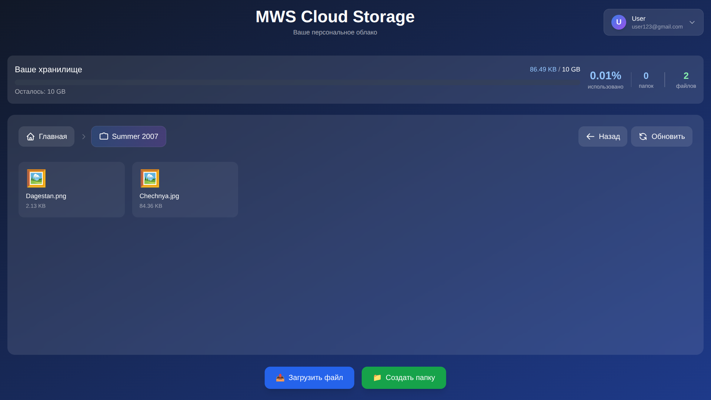
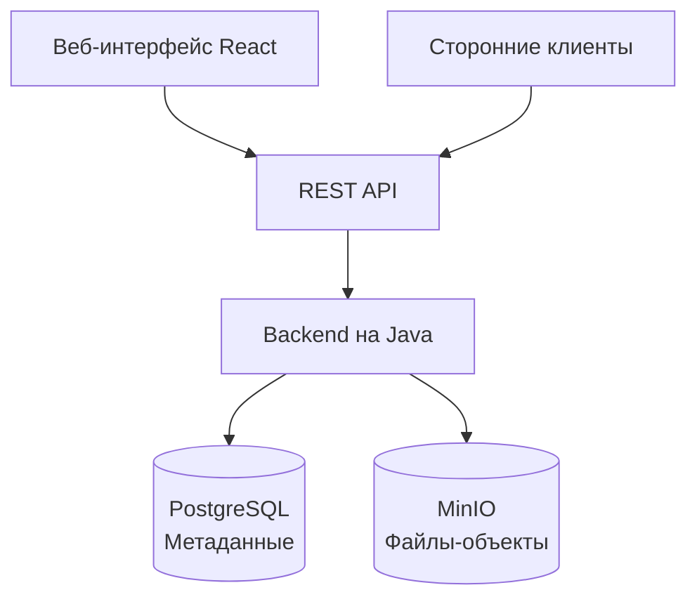

# MWS Cloud Storage ☁️

[](https://opensource.org/licenses/MIT)

**MWS Cloud Storage** — это полнофункциональное облачное хранилище файлов, разработанное на Java.
Проект представляет собой альтернативу таким сервисам, как Google Drive или Яндекс.Диск,
предлагающее разработчикам простой API, а пользователям — гибкую организацию файлов через
теги и надёжное хранилище.


*Главная страница веб-интерфейса*

---

## 🚀 Установка и запуск

Проект состоит из двух частей: **backend** (Java) и **frontend** (React)

1. **Клонируйте репозиторий**

``` bash
git clone https://github.com/algaa22/MWS-Cloud-Storage_team-4.git
cd MWS-Cloud-Storage_team-4
```

2. **Создайте файл с переменными окружения `.env`**

Для запуска через `docker-compose`: в корневой папке проекта создайте `.env`.

Например:

```bash
DB_URL=jdbc:postgresql://postgres:5432/cloud_storage_db
DB_NAME=cloud_storage_db
DB_USERNAME=postgres  
DB_PASSWORD=super_secret_password_123  
  
MINIO_URL=http://minio:9000
MINIO_USERNAME=minioadmin
MINIO_PASSWORD=super_secret_password_123

JWT_SECRET_KEY=d8f4a9c3e7b2f6a1d9e4c8b3f7a2e5d1f9c6b4e8a3d7f2c9e1b5f8d3a6c9e4b7
```

3. **Настройте конфигурационный файл `src/main/resources/config.yml`**
4. **Соберите docker-образ**

В корневой папке проекта запустите:

``` bash
docker build -t cloud-storage-app .
```

5. **Запустите всю инфраструктуру через `docker-compose`**

```bash
docker-compose up -d
```

6. (Дополнительно) **Запустите `frontend` вручную** (для разработки)

В папке `cloud-storage-frontend` введите:

``` bash
npm run dev
```

---

## 🔐 Настройка HTTPS

Если вы планируете запустить сервер на HTTPS, то перед сборкой добавьте ваши SSL-сертификаты `server.crt`, `server.csr`,
`server.key`, `server.p12` в папке проекта `src/main/resources/ssl`

---

## ✨ Возможности

#### 📁 Работа с файлами

- **Загрузка и скачивание любого размера** — система позволяет использовать чанковую передачу для файлов больших
  размеров

- **Полноценная файловая система** — создание, перемещение, переименование и удаление папок и файлов через удобный
  веб-интерфейс

- **Гибкая организация** — поддержка системы тегов для категоризации файлов помимо классической структуры папок

- **Контроль доступа** — настраиваемая видимость файлов (приватные, доступные по ссылке, публичные)

*Техническая деталь:* для соответствия стандартам S3-совместимых хранилищ чанковая передача используется для файлов с
размером от `5 МБ`

#### 🔐 Безопасность и учётные записи

- **Полный цикл аутентификации** — регистрация, вход и выход

- **Надёжные сессии** — JWT-токены с автоматической ротацией через refresh-токены

- **Управление профилем** — изменение имени пользователя и пароля

**🌐 Веб-интерфейс**

- **Удобный веб-клиент** — интуитивный интерфейс для управления файлами без необходимости использовать API напрямую

---

## 🏗️ Архитектура

Система состоит из **независимых модулей**, каждый из которых отвечает за свою задачу. Пользователь может работать как
через **веб-интерфейс**, так и напрямую через **API**.


```mermaid
graph TD
    A[Веб-интерфейс React] --> B[REST API]
    C[Сторонние клиенты] --> B
    B --> D[Backend на Java]
    D --> E[(PostgreSQL<br/>Метаданные)]
    D --> F[(MinIO<br/>Файлы-объекты)]
```

#### Ключевые архитектурные решения:

1. **Разделение логики и данных**

    - **PostgreSQL **хранит всю **логическую структуру**: пользователей, виртуальные пути файлов, теги, права доступа

    - **MinIO (S3-совместимое)** хранит **сами файлы** как объекты. Это обеспечивает отказоустойчивость и эффективность
      для
      больших бинарных данных

2. **Двухуровневая система путей**

    - **Для пользователя**: привычные пути (`documents/report.pdf`)

    - **Для системы**: в MinIO файл хранится по ключу`user_id/file_id`, что идеально соответствует объектной модели S3 и
      обеспечивает высокую производительность

3. **Единая точка входа**

    - Весь доступ к системе происходит **только через REST API** нашего backend

4. **Контейнеризация**

    - Каждый компонент (Backend, PostgreSQL, MinIO) работает в **отдельном Docker-контейнере**. Это гарантирует
      идентичность окружений на всех машинах и упрощает развёртывание одной командой (`docker-compose up`)

---

## 🛠 Технологии


---

## 📖 Документация API

Все запросы к API начинаются с префикса `/api`. Почти все операции (кроме авторизации) требуют заголовок:
`X-Auth-Token: <access_token>`

Опциональные параметры или заголовки обозначены через `*` 

#### 1. Пользователи и Аутентификация (`/api/users`)

| Endpoint | Method | Headers                                              | Description |
| --- | --- |------------------------------------------------------| --- |
| `/auth/register` | `POST` | `X-Auth-Email`, `X-Auth-Password`, `X-Auth-Username` | Регистрация нового аккаунта |
| `/auth/login` | `POST` | `X-Auth-Email`, `X-Auth-Password`                    | Вход и получение пары токенов |
| `/auth/logout` | `POST` | `X-Auth-Token`                                       | Инвалидация текущей сессии |
| `/auth/refresh` | `POST` | `X-Refresh-Token`                                    | Обновление Access Token |
| `/info` | `GET` | `X-Auth-Token`                                       | Получение данных текущего профиля |
| `/update` | `POST` | `X-Auth-Token`, `X-New-Username*`, `X-New-Password*` | Смена данных пользователя |

#### 2. Работа с файлами (`/api/files`)

| Endpoint | Method | Query Params                                              | Headers                    | Description                                  |
| --- | --- |-----------------------------------------------------------|----------------------------|----------------------------------------------|
| `/list` | `GET` | `parentId*`, `recursive*`, `includeDirectories*`, `tags*` | —                          | Список объектов в директории                 |
| `/info` | `GET` | `id`                                                      | —                          | Детальные метаданные файла                   |
| `/` | `PUT` | `id`, `newName*`, `newParentId*`                          | `X-File-New-Visibility*`   | Изменение метаданных                         |
| `/` | `DELETE` | `id`                                                      | —                          | Удаление файла                               |
| `/download` | `GET` | `id`                                                      | —                          | Чанковое скачивание                          |
| `/upload` | `POST` | `name`, `parentId*`                                       | `X-File-Tags`, `X-File-Size` | Обычная загрузка или старт чанковой загрузки |
| `/upload/resume` | `POST` | `name`, `parentId*`                                       |                            | Возобновление прерванной чанковой загрузки   |

#### 3. Работа с директориями (`/api/directories`)

| Endpoint | Method | Query Params                     | Description |
| --- | --- |----------------------------------| --- |
| `/` | `PUT` | `name`, `parentId*`              | Создать новую папку |
| `/` | `POST` | `id`, `newName*`, `newParentId*` | Переименовать или переместить папку |
| `/` | `DELETE` | `id`                             | Рекурсивное удаление папки и всего содержимого |

### 📦 Формат ответов

Большинство успешных операций возвращают JSON следующего вида:

```json
{
  "success": true,
  "message": "Операция выполнена",
  "data": { ... } 
}

```

### 🔄 Чанковая передача данных

Для работы с файлами сервер использует динамическое переключение стратегии обработки трафика в `ChannelPipeline`.

#### Загрузка (Upload)

Если **X-File-Size** во входящем запросе превышает лимит **5 МБ** (`maxAggregatedContentLength`), система переключается с агрегированной обработки в памяти на чанковую.

Если возникла временная ошибка записи, сервер вернет статус `409 Conflict` с полем `action` в теле:

* `RESUME_CONTINUE`: Ошибка записи чанка. Повторите отправку с той части, что указана в полях `currentFileSize` и `partNum`.
* `RESUME_FINALIZE`: Ошибка при сборке файла. Повторите финальный `LastHttpContent`.

#### Скачивание (Download)

Запросы на `GET /api/files/download` **всегда** обрабатываются в потоковом режиме (`CHUNKED`), независимо от размера файла.

---

## 🗺️ Roadmap

Мы активно развиваем проект и планируем реализовать следующие функции и улучшения:

- **Система уровней доступа** к файлам и папкам с гибкими правилами для совместной работы

- **Расширенный поиск по файлам** для полнотекстового поиска и фильтрации

- **Усиление безопасности**: защита от инъекций, улучшение валидации и прочее

- **Готовый фронтенд** с полировкой UI/UX, адаптивным дизайном и улучшенной производительностью

---

## 👥 Команда / Контакты

**Команда:**

* **Сергей** @seregawallapop — Архитектура & Сетевой слой & API

* **Анастасия** @alg_aaa — Бизнес логика & Веб-интерфейс

* **Павел** @PavelStar899 — Слой данных

**Обратная связь:**  
По всем вопросам, связанным с проектом, пожалуйста, создавайте **Issue** в репозитории проекта на GitHub.

_© 2025 Команда MWS Cloud Storage. Все права защищены._